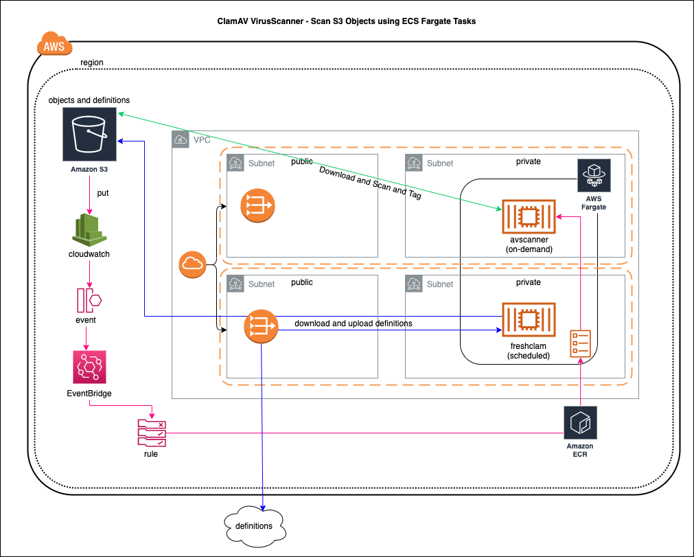

# virusscanner-clamav-container
ClamAV virus scanning solution on AWS for scan S3 objects, using Fargate and ECS.

## Pre-Requisites
- Docker installed and running locally
- AWS CLI configured with your credentials
- CloudTrail - Create Trail, enable cloudwatch logs, enable Management events and Data events on specific buckets - recommended. If not, even log buckets will get scanned.
- Download this project to access the files in the instructions.

# RunBook

### Setup for ClamAV Scanner

1. Run **cloudformation/base/clamav_worker_ecr_repo.yaml** and **cloudformation/base/clamav_defs_ecr_repo.yaml**
   - This will create an ECR repo with the name `virusscanner` and another ECR repo with the name `clamav-virus-definitions`
     

   A. An S3 bucket will be created when you run **clamav-defs-ecr-repo**. Make note of the bucket name (not the ARN)
      - When running **clamav_defs_ecr_repo** and **clamav-defs-service** - make sure to specify the name of the bucket in the parameters
      - Example: `clamav-govcloud-s3-definitions`
    

   B. Modify **containers/clamav/initialize** line 3 with your desired bucket name. Modify **containers/clamav/Dockerfile** - on line 21 if the bucket isn't located in `us-gov-west-1`

   C. Modify **containers/freshclam/Dockerfile** - edit lines 21 and 24 with the same region and bucket information

2. Run `aws configure` and setup aws-cli with the credentials from IAM - accessKey and secretKey, ensure Docker engine is running
   
   A. Run the following with the right Region, AccountID - aws ecr get-login-password --region <<AWS_REGION>> | docker login --username AWS --password-stdin <<AWS_ACCOUNTID>>.dkr.ecr.<<AWS_REGION>>.amazonaws.com

   B. then run the `./container_push.sh` file in the downloaded project - **project_name/containers** folder
   - Account Number and Region will be auto-populated via aws configure
     
3. *Optional Step - This will create a new VPC to host your ClamAV Scanner*
   - Run **cloudformation/base/vpc-networking.yaml**
   - This will create a 10.111.0.0/16 network with public and private subnets.
     
4. Run **cloudformation/fargate/fargate-cluster.yaml** 
   - This will create a ECS Cluster with name `virusscanner`
     
5. Run **cloudformation/fargate/clamav-defs-service.yaml** 
   - select desired private subnets
   - select corresponding VPC
     
6. Run **cloudformation/fargate/clamav-worker-service.yaml**
   - select desired private subnets
   - select corresponding VPC
  
# Testing Instructions

## Manually Update S3 ClamAV Definitions

1. Go to Elastic Container Service (ECS) Dashboard in AWS Console.
2. Click Task Definitions
3. Select clamdefs-task
4. In Actions - select Run Task
   - select Fargate as Launch Type
   - Select Cluster VPC
   - Select 2 Private Subnets
   - Click Edit Security Groups and selectvirusscanner-definitions-service-XXXX security group
   - Click Run Task
   - See logs for completion, you should see files in virusscan-definitions s3 bucket.

## Test Scanning
1. Drop a test file into the S3 bucket that was configured
2. Verify that a task has been created in the scanning ECS Cluster - ECS Console, Click Cluster, select the Cluster, Tasks, and click on PENDING task and look at logs. 
3. Once the Task is done, check the tags of the file that was uploaded to S3. Should report a "Clean" status.

<!-- 

### Manual Setup Instructions

### Setup for Clam Definitions ECR

1. Create a private repository in ECR - name it **clamdefs**
2. Open the Dockerfile within **containers/freshclam/** and **edit line 21**, replacing the S3 bucket with an S3 bucket you wish to host the ClamAV virus definition files from
3. Select the repo in ECR, and select **view push commands**
4. Follow the instructions provided to authenticate with ECR, build the docker image, tag the image, and push the image into ECR
5. Once those steps have been completed, run **fargate-ecs-defs.yml**
    - select the desired VPC for the cluster to run in
    - select the desired subnet for the cluster to run in
      - *Please note, this must be a public subnet in order to fetch definitions from the internet*

### Setup for Clam Worker ECR

1. Create a private repository in ECR - name it **virusscanner**
2. Open the Dockerfile within **containers/clamav/** and **edit line 20**, replacing the S3 bucket with the proper S3 bucket URL
3. Select the repo in ECR, and select **view push commands**
4. Follow the instructions provided to authenticate with ECR, build the docker image, tag the image, and push the image into ECR 

-->
